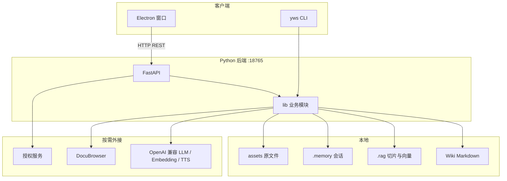

# 易知 YiZhi

**自我进化个人知识库**（Myknowledge）

> 没有出处的聪明，不过是幻觉；有出处的沉默，方才是诚实。

本地优先的桌面知识库：把 PDF、Office、网页、音视频扔进去，它切块、建索引、做向量。你来问，它先翻你的文件，翻到了才开口，并标出第几页第几段；翻不到，它宁可拒答。问过的好答案、写过的好稿子，经你确认后再写回库里——库越用越厚，答得越像你自己的口气。

[下载 Windows 安装包](https://www.yzwhysxx.cn/yizhi/Yizhi-Setup-3.0.2.zip) · [更新记录](https://www.yzwhysxx.cn/yizhi/changelog.html) · [操作手册](操作手册.md) · [CLI](CLI.md)


**进得来 · 搜得到 · 答有据 · 推有度 · 越用越厚**

---

## 解决什么问题

资料散落在文件夹、笔记软件和聊天窗口里。搜得到文件名，搜不到那段话。丢给通用大模型，它答得头头是道，一对原件却对不上，还可能把两个项目拧成一段从未存在过的结论。

易知绑的是**你硬盘里的粮食**，不是互联网的残羹。规则很硬：

- 回答只引库内片段，脚下每一寸都有出处
- 库内不够时明确说「无法基于库内事实回答」，不拿模型去补全
- 优质问答与文稿可以归档回库，下次同类问题能翻到你上次认过的结论

适合研究者、教师、项目经理、写作者、一人公司：案头资料多、怕幻觉、又希望产出能回到同一套库里的人。

---

## 功能

### 千般格式，一室而收

PDF、Word、PPT、Excel、TXT、Markdown、PNG、JPG、MP3、MP4，以及一条网页 URL。拖进 `inbox` 即可：提取文本、分类、索引、向量分块。网页会抓正文、去重、本地存档。

别处已有成体系的文件夹也不必搬家——**外联目录**只读不写，文件留在原处，内容进入检索。

### 混合检索，答必有据

关键词抓专有名词，向量抓换种说法的同义；FTS5 与 RRF 融合排序。脚注带来源与页码，可跳到 PDF 原文。可勾选「只在这几份文件里翻」。连续对话默认开，追问「展开第二点」接得上。也会检索你过去确认过的答案，不只翻旧 PDF。

界面：**提问**、**查询**、**笔记**、**资料库**、**历史**。

### 推演：从已知望向未知

问答回答「是什么」，推演探问「会怎样」。只从本地取材（wiki、原文件、RAG 片段、外联目录、记忆），不拿库外知识来凑。报告分四层：

1. **已知事实** — 引库内片段，逐条标出处
2. **可能走向** — 二至四条，标依据强弱：强据则言确，弱据则言或，无据则不书
3. **关键不确定因素** — 哪里还看不清
4. **库内缺口** — 还缺什么资料才能推得更准

结果可存成笔记。新资料入库后可以再推一次，看依据强度有没有变。

### 从读到写

给一个主题，从库里拽片段，按体例生发：综述、教程、对比、播客稿。可导出 Word。播客体例支持 TTS 双音色（主持人 / 嘉宾）合成完整音频。

写文章旁可开**场景模板**（草案预览，确认后才写入，不编造未提供的事实）：

| 模板 | 用途 |
|------|------|
| 教师课堂六步 | 备课 → 上课 → 练习 → 作业 → 检测 → 反馈 |
| 考研 / 教研 | 备考与教研材料 |
| 自媒体 | 选题到成稿 |
| 职场 | 周报、纪要、方案 |
| 一人公司 OPC | 个体经营相关产出 |

### 自我进化，越用越厚

不是模型变大了，是你的库在翻检与书写里长肉：

- 有依据的好问答，可归入笔记
- 再搜同类问题时，能翻到你上次确认过的结论
- 综述存回库后，再写同类主题时它自己也是来源
- **自我蒸馏**：`distill/` 四层 Memory / Skills / Principle / Meta；蒸馏默认先预览，你写「确认入库」才写入
- 后台 Loop 巡检 inbox 未处理文件、RAG 空白区，提醒或自动入库（见 [LOOP.md](LOOP.md)）

界面里还有 **记忆与进化**、顶栏 **本周服务进度**（测通大模型 → 入库/笔记 → 有出处提问 → 可选蒸馏）。

### 双入口，同一套库

| 入口 | 给谁 |
|------|------|
| Electron 窗口 | 日常提问、推演、导入、写作、设置 |
| `yws` 命令行 | 脚本、Cursor Agent、批量入库 |

知识库目录就是 Obsidian vault：用 Obsidian 改 Markdown，再 `yws index` 刷新检索。Skills 可扩展（`skills/` + `yws skill`）。

### 本机说了算

数据与索引在你的机器上。LLM / Embedding / TTS 走你自己配的 OpenAI 兼容接口（通义、智谱等均可）。不配 Key 也能入库、查询、建索引；提问、写作、推演才需要模型。账单在你自己手里。

当前安装包仅支持 **Windows 64 位**。设置里可**初始化知识库**（强确认后清用户资料；外联只取消登记，不删外部真实文件）。

---

## 架构



| 层 | 选型 |
|----|------|
| 桌面 | Electron 33，无前端框架 |
| 后端 | Python 3.10+ · FastAPI · Uvicorn |
| 检索 | 词频 + SQLite 向量 · 混合检索 · 可选外联 |
| 解析 | pypdf / pdfplumber / python-docx / pptx / openpyxl 等；PDF 分栏阅读序 |
| 进程 | `启动易知.bat` 拉起 Electron；主进程 spawn `python -m backend`，健康检查通过后打开界面。CLI 直接 import `lib/`，不走 HTTP |

设计口径见 [docs/易知项目报告书.md](docs/易知项目报告书.md)（报告中的版本号可能落后于安装包 3.0.2）。

---

## 和常见做法的差别

| | 笔记软件 | 通用聊天模型 | 易知 |
|--|----------|--------------|------|
| 资料在哪 | 笔记里 | 训练语料 + 你粘贴的上下文 | 你的 wiki + 原文件 + 外联目录 |
| 找不到原文时 | 你自己翻 | 常常仍会编一段 | **拒答** |
| 出处 | 靠你记得 | 多数没有页码 | 脚注到文件与页 |
| 写完的东西 | 另存一份就断了 | 停在对话框里 | 确认后可写回库，下次能被检索到 |
| 推演 | 无 | 易把网上常识当你家的事实 | 只凭库内证据，并标缺口 |

---

## 克隆与运行（开发）

环境：Windows x64 · Python 3.10+ · Node.js 18+。

```powershell
git clone https://github.com/yiwensheng/myknowledge.git
cd myknowledge
copy .env.example .env
# 编辑 .env：填入 OpenAI 兼容的 LLM / Embedding（提问与写作才需要）
```

双击 `启动易知.bat`（首次会装依赖并 `yws init`）。或：

```powershell
cd electron
npm install
cd ..
python -m backend
# 另开终端
cd electron
npx electron .
```

把文件拖进 `inbox`，整理后再提问。命令行同样走这一套库：

```powershell
yws init
yws url "https://example.com/article"
yws ingest
yws ask "你的问题"
yws produce "主题" --wiki
yws query 关键词 --rag
yws list
```

完整命令见 [CLI.md](CLI.md)。人设与提示词在 `prompts/`。

**不要提交** `.env`、授权密钥、`dist/` 安装包、个人 `assets/documents` 与 `output/`。仓库 `.gitignore` 已排除这些路径。

---

## 终端用户：安装包

1. 从 [Yizhi-Setup-3.0.2.zip](https://www.yzwhysxx.cn/yizhi/Yizhi-Setup-3.0.2.zip) 下载（仅 Win64）
2. 解压后运行安装程序；若 SmartScreen 拦截，见 [常见问题](https://www.yzwhysxx.cn/yizhi/faq.html)
3. 在设置中配置大模型并「测试连接」
4. 导入资料 → 提问

订阅、绑机与换机说明：[docs/易知授权运营.md](docs/易知授权运营.md) · [购买与订阅](https://www.yzwhysxx.cn/yizhi/purchase.html)

---

## 文档

| 文档 | 内容 |
|------|------|
| [操作手册.md](操作手册.md) | 导入、目录、外联、Obsidian |
| [CLI.md](CLI.md) | 命令行 |
| [LOOP.md](LOOP.md) | Loop 巡检 |
| [docs/易知项目报告书.md](docs/易知项目报告书.md) | 架构与模块 |
| [docs/commercial/changelog.html](docs/commercial/changelog.html) | 版本变化 |
| [docs/product/yizhi-promo.md](docs/product/yizhi-promo.md) | 产品说明原文 |

---

## 许可与第三方

易知是面向个人的桌面产品，发行安装包带订阅授权。本仓库便于阅读源码、提问题与协作开发。

内置 `third_party/DocuBrowser` 遵循其 **GPL-3.0** 许可证，见该目录 `LICENSE`。

---

资料在本地，规则在你手里。若它帮你从故纸堆里找回过一段原文，欢迎点右上角 **Star**，克隆一份自己改。

易文胜 · 2026 · 易知（Myknowledge）
