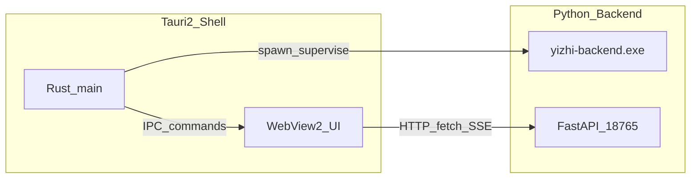

# 易知 · Tauri 壳迁移规格（方案 B）

> **前提**：见 [换栈决策基线](./换栈决策基线.md)。建议在方案 A 有阶段性收益后再做；**保留 Python 后端**，只换桌面壳。  
> **性质**：迁移规格（API / 启动 / 安装 / 更新边界）。本文不实施代码。

## 1. 目标与非目标

### 目标

- 用 **Tauri 2（Windows + WebView2）** 替换 **Electron 33** 作为窗口壳。
- 继续 spawn / 托管现有 **`runtime\yizhi-backend.exe`**，HTTP 调用 `http://127.0.0.1:18765`。
- 最大复用 [`electron/renderer/`](../../electron/renderer/)（HTML/CSS/JS，无 React）。
- 安装包壳侧体积降到 **数十 MB 量级**；总包仍受 Python runtime + 可选工具约束（配合方案 A）。

### 非目标

- 不重写 FastAPI / `lib/` 业务。
- 不把 RAG 迁到 Rust。
- 不强制跨 macOS/Linux 首发（可留架构，但验收以 Windows x64 为准）。
- 不在首版复刻 Electron 全部边缘能力（完整 file-viewer 等随 A4 降级策略）。

---

## 2. 目标架构



| 层 | 现状（Electron） | 目标（Tauri） |
|----|------------------|---------------|
| 壳 | `electron/main.js` | Rust `src-tauri` |
| UI | `electron/renderer/*` | 同目录迁入 Tauri `frontend`/`dist` |
| 预加载桥 | `preload.js` → `window.myknowledge` | Tauri `invoke` + 薄 JS 适配层，**保持同名 API** |
| 后端 | spawn `yizhi-backend.exe` | 同等；健康检查逻辑迁到 Rust |
| 用户数据 | `%LOCALAPPDATA%\Yizhi` | **不变** |
| 端口 | 18765 / DocuBrowser 18766 | **不变** |

---

## 3. 必须保留的契约

### 3.1 HTTP API

- Base：`http://127.0.0.1:{MYKNOWLEDGE_PORT}`，默认 **18765**。
- 启动门禁：`GET /api/health` → `ok` 且 capabilities 含业务所需项（至少现网使用的 `ask_stream` 等）。
- Renderer 继续 `fetch` / SSE；**不**把业务 RPC 全部改成 Tauri command（避免双通道分裂）。

### 3.2 环境变量（与现安装版对齐）

| 变量 | 含义 |
|------|------|
| `YIZHI_INSTALLED=1` | 安装版布局 |
| `WIKI_ROOT` | 默认 `%LOCALAPPDATA%\Yizhi` |
| `MYKNOWLEDGE_ROOT` / `MYK_ROOT` | 应用安装根（含 `runtime\`） |
| `MYKNOWLEDGE_PORT` | 后端端口 |
| `.env.user` | 用户覆盖，合并进后端环境 |

### 3.3 日志

| 文件 | 用途 |
|------|------|
| `%LOCALAPPDATA%\Yizhi\electron-boot.log` | 可更名为 `shell-boot.log`，首版允许继续写旧名以免文档断裂 |
| `%LOCALAPPDATA%\Yizhi\backend.log` | 后端 stdout/stderr |
| `%LOCALAPPDATA%\Yizhi\frozen-boot.log` | PyInstaller |

### 3.4 Wiki / 授权 / 更新元数据

- 知识库目录结构、授权文件、`latest.json` 渠道字段：**不变**。
- 自动更新：若现逻辑依赖 Electron 更新器，改为「检查 JSON + 下载 Setup 走 Inno」或 Tauri updater；**协议字段与许可证服务器 URL 不变**。

---

## 4. IPC 适配层（Electron → Tauri）

现有 [`preload.js`](../../electron/preload.js) 暴露的 `window.myknowledge` 须保持方法名，内部改 `invoke`：

| 方法 | 现实现 | Tauri 侧 |
|------|--------|----------|
| `apiBase` | 常量端口 | 只读配置 / Rust 注入 |
| `pickDirectory` | `dialog.showOpenDialog` | `tauri_plugin_dialog` |
| `ensureFileViewer` | 同步 vendor | 随 A4：可空实现或打开系统 |
| `openAssetViewer` | 独立 BrowserWindow | 新窗 WebView 或系统打开 |
| `openAssetSystem` | `shell.openPath` | `tauri_plugin_opener` / `open` |
| `openExternal` | `shell.openExternal` | opener 插件 |
| `getAppInfo` | version 等 | Rust `env!("CARGO_PKG_VERSION")` 与打包元数据 |

**适配文件建议**：`renderer/tauri-bridge.js`（或构建时替换 preload），使 `app.js` 少改。

### 主进程职责迁移清单（来自 `main.js`）

- [ ] 单实例锁
- [ ] Splash → 主窗切换
- [ ] 后端 spawn / 杀进程 / 退出时回收
- [ ] Health 轮询与超时 ErrorBox
- [ ] 托盘 / 菜单（若有）
- [ ] 静默启动（`QUIET_LAUNCH` / VBS 无黑窗）
- [ ] PATH 注入 `third_party\*\`（若工具仍本地）

---

## 5. 启动时序（验收用）

```text
1. 用户点快捷方式（Inno 生成，可改为 yizhi.exe 直接入口，不再强依赖仅启 Electron 的 VBS）
2. Tauri 进程启动 → 写 shell-boot.log
3. 解析安装根，定位 runtime\yizhi-backend.exe
4. spawn 后端（cwd/环境与现网一致）
5. 轮询 GET /api/health 直至就绪或超时
6. 加载 renderer（本地 asset）
7. UI fetch apiBase
```

失败：中文对话框 + 日志尾部；**不得**静默退出。

---

## 6. 安装与目录布局

### 建议安装树（配合方案 A）

```text
{app}\
  yizhi.exe                 # Tauri 主程序
  runtime\
    yizhi-backend.exe
    _internal\...
  frontend\ 或 resources\   # 打包后的 HTML/JS/CSS/vendor
  third_party\              # 可选；A2 后可空
  .env.user                 # 或仅 LOCALAPPDATA
```

- **删除**：`electron\node_modules\electron\dist\electron.exe` 整棵 Electron 树。
- **Inno**：[`YizhiSetup.iss`](../../scripts/installer/YizhiSetup.iss) 入口改为 `yizhi.exe`；自检改查 Tauri 产物 + `runtime\yizhi-backend.exe`。
- **WebView2**：依赖系统 Runtime；安装程序可检测缺失并引导 Evergreen Bootstrapper（可选打入 redist）。

### 构建链（目标）

```text
build-backend-exe.ps1
  → cargo tauri build
  → 组装 staging（runtime + frontend + 可选 tools）
  → Inno → Yizhi-Setup-{ver}.exe
```

开发态：`tauri dev` + 系统 Python `-m backend`（`YIZHI_DEV=1`）。

---

## 7. 自动更新边界

| 项 | 规格 |
|----|------|
| 检查 | 继续打许可证/静态服务器上的 `latest.json`（字段兼容现客户端） |
| 下载 | Setup.exe 或 msix（首版保持 **Inno Setup.exe** 最简单） |
| 安装 | 外置安装器；Tauri 进程退出后由 Inno 覆盖 `{app}` |
| 热更前端 | 允许后续做 resource 热更；**后端 exe 变更须整包或独立 hotpatch**（现有 [`hotpatch-install`](../../scripts/hotpatch-install-2.2.0.ps1) 思路可保留） |

禁止：更新器改写用户 `WIKI_ROOT` 笔记数据。

---

## 8. 风险与缓解

| 风险 | 缓解 |
|------|------|
| WebView2 缺失（旧系统） | 安装检测 + Bootstrapper |
| SSE/流式在 WebView 差异 | 用现网 ask/produce stream 做专项测试 |
| 文件拖放 / 剪贴板 | 逐项对照 Electron 行为补测 |
| 杀软误报 Rust exe | 签名（与现发版签名流程对齐） |
| GPL DocuBrowser | 仍 sidecar；规格不变 |

---

## 9. 里程碑（实施时）

| 里程碑 | 交付 | 验收 |
|--------|------|------|
| M0 | 空 Tauri 窗加载静态页 + 手动起后端 | 能打开设置页 |
| M1 | Rust 托管后端 + health + 提问流式 | 与 Electron 行为一致 |
| M2 | IPC 桥对齐（选目录/外链/系统打开） | 导入与预览路径通过 |
| M3 | Inno 安装包 + 无 Electron 树 | 体积对比表；T1–T8 |
| M4 | 更新检查与签名 | 发版手册更新 |

**工作量粗估**：熟悉 Tauri 的前提下 **数周～2 个月**（含安装/更新/回归）。

---

## 10. 相关文件（迁移时必碰）

| 文件 | 角色 |
|------|------|
| [`electron/main.js`](../../electron/main.js) | 行为源规格 |
| [`electron/preload.js`](../../electron/preload.js) | IPC 表面 |
| [`electron/renderer/app.js`](../../electron/renderer/app.js) | UI |
| [`scripts/installer/YizhiSetup.iss`](../../scripts/installer/YizhiSetup.iss) | 安装 |
| [`scripts/installer/YizhiStart.vbs`](../../scripts/installer/YizhiStart.vbs) | 启动（可被 exe 入口取代） |
| [`docs/commercial/构建安装包.md`](./构建安装包.md) | 发版文档 |
| [`docs/commercial/安装包瘦身任务清单.md`](./安装包瘦身任务清单.md) | 与 A 协同 |

---

## 11. 与方案 A 的依赖

- **强依赖 A1**：双 Python 不去掉，Tauri 换壳后总包仍偏肥。
- **建议先 A4**：否则还要把巨型 file-viewer 打进 WebView 资源。
- **A2 可并行**：可选工具外置与壳无关。
