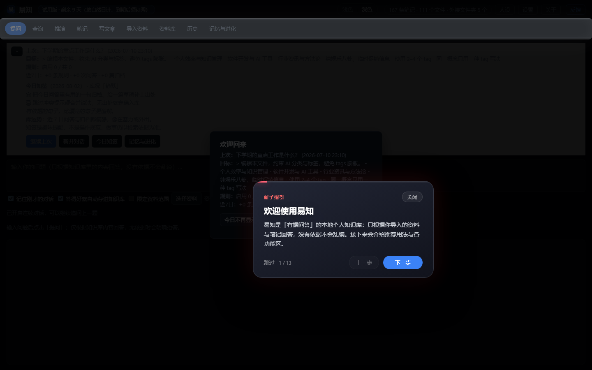
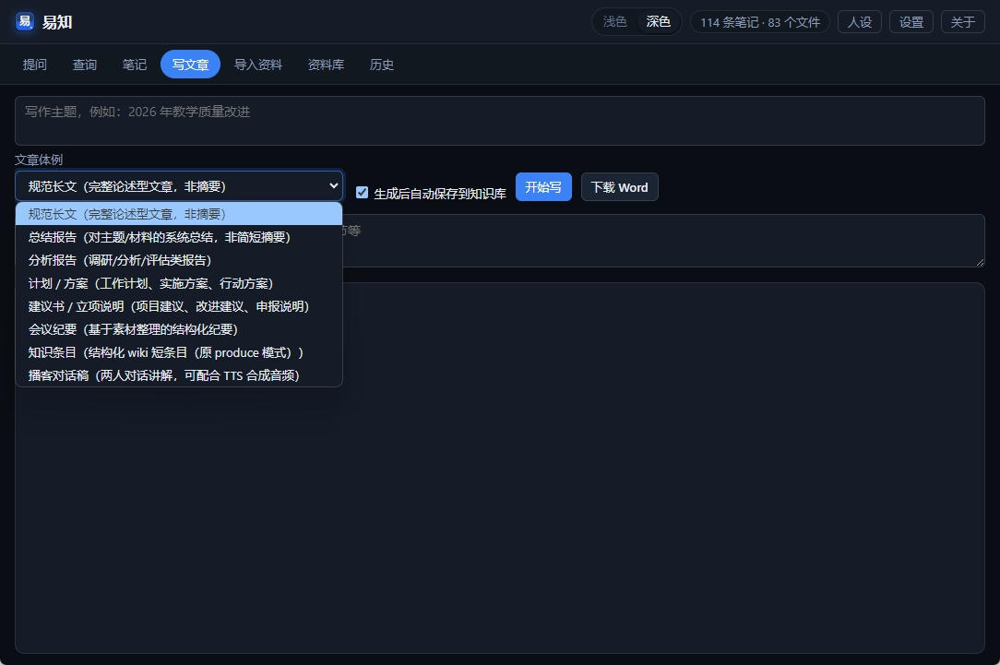
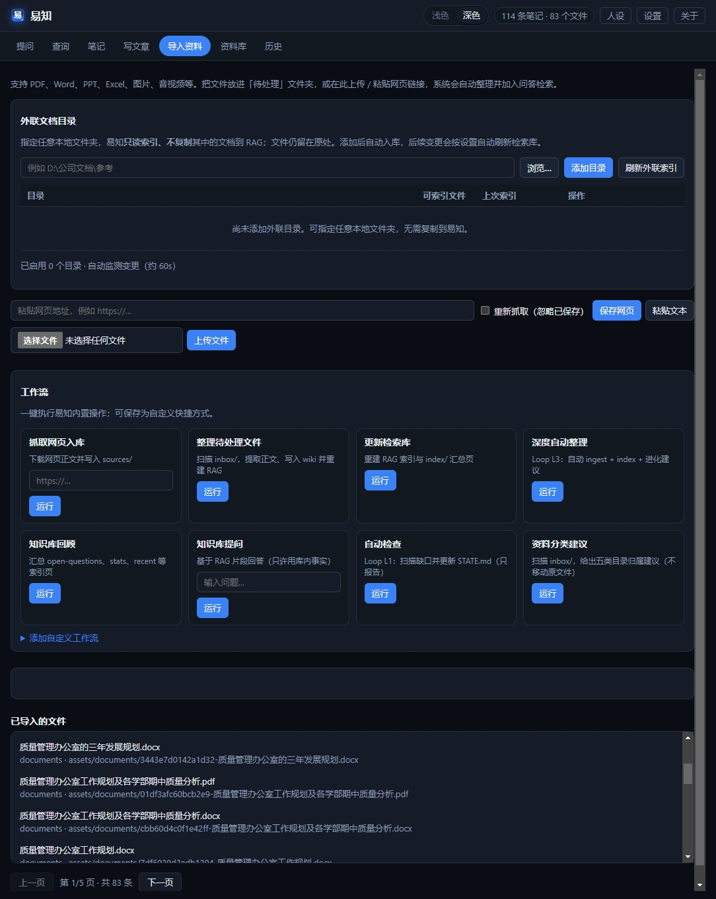
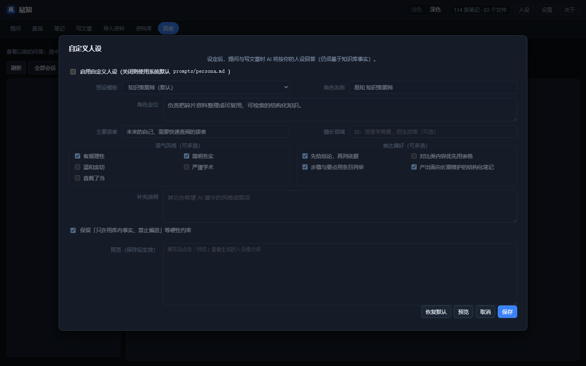
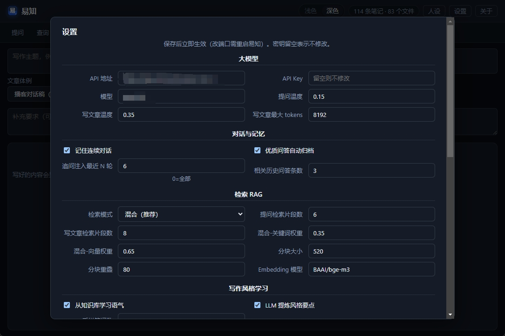

# 受够了 AI 瞎编？我把自己的资料库做成了「第二大脑」

> **摘要**：本地资料 + 混合 RAG + 大模型，只答有据可查的内容；让资料生发出新知，**越用越聪明**。  
> **标签**：知识管理 · 大模型 · RAG · 自我进化 · 易知

---

## 那个让我决定动手的晚上

我叫易文胜。「易知」是我后来给这套东西起的名——「易」是我姓，也是「容易」；「知」是知识，也是确证地知晓，更是从旧资料里**生发出来的新知**：沉睡的 PDF 不该只在硬盘里占地方，该在你追问、写作、复盘的过程中，慢慢长出新的笔记、新的结论、新的讲稿。资料已经在手，就该容易找到、容易对上原件；对不上的，宁可不说——但**对得上的，要让它继续长**。去年有阵子，我几乎每周都在重复同一件事：凌晨一点，对着三个文件夹、两个笔记 App、一屏 ChatGPT，找一份「我明明存过」的材料。

硬盘里躺着几百份 PDF、PPT、会议纪要；标签越打越乱；越急越搜不到。最后只好把问题扔给通用大模型——它回答得流畅极了，语气笃定，结构完整。我差点就要复制粘贴交差了。

直到我对着一份内部材料追问细节。它把两个项目的结论拧在一起，还帮我「总结」出一段听起来特别专业的分析。我打开原件一对，根本没有。

那天晚上我关掉了聊天窗口，坐在显示器前发了会儿呆。缺的不是更聪明的模型，缺的是有人帮我把**已经拥有的东西**讲清楚、串起来、**生出新的东西**——而不是替我决定世界长什么样。

**没有出处的聪明，是幻觉；有出处的沉默，是诚实。**

2026 年，**易知**从名字里的那句承诺，变成了能双击打开的软件。

---

## 易知是什么？用一次你就懂了

它不是 ChatGPT 套壳。套壳的问题是：模型太能说了，说得多你就越容易忘——它引用的到底是哪份文件，往往说不清。

易知绑的是你自己的资料。PDF、Word、网页、播客稿，扔进去，它切块、建索引；你问它，它**先去翻你的文件**，翻到了才开口，还告诉你第几页。翻不到？它宁可闭嘴。

但我心里还有另一半期待：**让资料生发出新知，而且越用越聪明。** 不是把文件供在冷宫里，而是问出来的好答案、写出来的好稿子，能归档回库，越积越厚——昨天的材料，变成明天思考的起点；你问得越多、写得越好，下一次检索的「参考书」就越厚。这叫**自我进化**：不是模型变大了，是你的知识库在长肉。

资料在本地，规矩也在本地。

---

## 第一次问对问题的那天

做出易知之后，我做的第一件事，就是把那堆让我抓狂的材料全倒进 inbox。

等索引跑完——我习惯扔完就去泡杯茶——回来打开「提问」，敲了一句：这份材料第三段到底在讲什么？

它没跟我扯宏观趋势，也没给我来一段「综上所述」。它先干了一件事：**RAG 检索**——用人话讲，就是「先翻书，再开口」。易知默认走 **Hybrid 混合检索**：关键词抓专有名词，**Embedding 向量**抓换种说法的同款意思，两边加权一融合。我机器上六千多段文本、三千多条向量，回来的是带脚注的段落，点一下，跳到 PDF 第 17 页。

不是「我觉得应该是这样」。

是「你的原件上写了这样」。

那一刻我才觉得，这玩意儿值得给别人看。

后来我用顺了：大模型接 OpenAI 兼容接口，通义、智谱都行；字流式蹦出来，不用干等；上一题刚问完，下一题追问「展开第二点」，它记得住——**连续对话**不是炫技，是让上下文接得上。写方案要对口径时，我会勾选「限定资料」，只搜那几份文件，心里踏实。问得特别值的那几次，我会让它**自动归档**进笔记；过阵子再搜同类问题，除了旧 PDF，还能翻出上次我自己确认过的答案。**越用，库越厚；库越厚，它越懂你在干什么。**

---

## 从一篇稿子到一条播客

易知不光能答，还能写。

有一回我要把几份零散笔记整成一篇综述。以前的做法是：打开五个窗口，复制粘贴，再让 AI「润色」——润着润着，不知道哪句是原文、哪句是编的。现在在「写文章」里给个主题，它从库里拽片段，按体例往外吐；我看着字一行行出来，像有人坐在我旁边念参考书。

写完存回知识库，导出 Word，都顺手。最让我觉得「亮」的一次，是播客体例：对话稿生成完，**TTS 双音色**——主持人一个声，嘉宾一个声——合成一整条音频。读资料、写稿、念出来，一条线串完。

**不是 AI 替你思考，是 AI 替你把已经拥有的东西讲清楚——然后，生出新的。**

导入也不挑：PPT、Excel、音视频、网页链接，扔进去就进索引；外联目录整文件夹挂着，原文件不动，改了自动重扫。问得好的对话会自动归档，写出的综述能存回知识库——**旧资料进，新知出**，库越用越厚、越用越聪明。不像用完即走的聊天框，更像**会自己长大的第二大脑**。

---

## 我平常怎么用它（你也可以）

我现在的节奏很简单。

早上双击 **「启动易知.bat」**，界面起来，顶栏改改人设、模型参数，深浅色随心情切。主界面就是提问，像跟同事发消息。

有新材料就打开「导入资料」，批量上传或贴个 URL。索引跑完，该问的问，该写的写。需要核对原文，去「资料库」——原文件、RAG 切片都能看，PDF 能预览，引用能跳到页。

「历史」里留着以前的会话。项目收尾时，我常会翻回去续聊，或者导出 Word 当复盘底稿。用得久了，你会明显感觉到差别：同样是问一个新话题，它能从你**以前问过、写过、归档过**的东西里多捞出几段——不是 AI 突然变聪了，是**你的第二大脑真的在进化**。数据在本地，大模型 API 自己配，检索索引不花钱；用多少算多少，心里也有数。

---

## 真实一周：我靠它省下的不是时间，是底气

说几个具体场景，不装。

周三下午，临时要核对一份政策文件里的表述。以前得翻文件夹、搜关键词、再开 ChatGPT「帮我总结」——总结完心里还是虚。那天我把相关 PDF 扔进易知，勾选「限定资料」，问：「第三条和附则里，对报名资格的说法有没有矛盾？」

它没给我写小作文。它拖出来两段原文，脚注标得清清楚楚。我对着屏幕逐字看完，十分钟后就能回电话：有，矛盾在这里，建议以某页某段为准。

**这种底气，通用聊天框给不了。**

周五晚上，我要把一周散落的教研笔记整成一篇对内分享稿。打开「写文章」，主题写「本周三个实验课反馈」，体例选综述。它从库里捞片段，流式往外吐；我边看边改，改完存回知识库，顺手导出 Word。同事第二天问「这段数据哪来的」，我能指到具体笔记条目——不是「AI 说的」，是「库里的」。那篇稿子存回去之后，下周再写同类主题，它又能引用这份综述——**一圈下来，知识在库里转，越转越活。**

还有一次突发奇想：把稿改成播客对话体，双音色 TTS 合成一条音频，丢群里当预习材料。同事回我：「这不像机器念稿，像两个人在聊。」我暗爽。读资料、写稿、念出来，真的可以在一个工具里闭环。

精句再来一句：**聊天框用完即走，知识库越用越聪明。**

---

## 越用越聪明，靠的不是魔法

有人问我：「自我进化」是不是营销词？

我的回答很土：**就是你用得越多，库里的东西越多；库里东西越多，它答得越有你的味道。**

优质问答可以自动存进笔记；连续对话记得住上文；写出的文章能回写知识库；inbox 里还没整理的货，后台也会帮你盯着——该入库的入库，该索引的索引。你不必懂这些机制叫什么，只要知道：**易知不是一次性工具，是养得活的系统。**

用得越久，越不像在问一个陌生的 AI，越像在翻自己那本越写越厚的活书。

## 两个我会特意调的配置

易知不是「装完就用」的傻瓜相机，但也不用你懂代码。

顶栏 **「人设」** 我会设成偏务实、少套话的口吻——写对内材料时不想要「亲爱的用户」那种腔。语气风格、表达偏好勾一勾，预览里能看见最终喂给大模型的那段人设 prompt，心里更有数。

**「设置」** 里我动得最多的是三块：大模型接口、RAG 检索模式、播客 TTS 音色。模型和 Key 自己配；RAG 默认混合检索我懒得动；写播客时会给主持人、嘉宾各选一个声线，旁边还能试听。改完保存，立刻生效，不用重启电脑。

这两处调顺了，后面几乎就是：导入 → 问 → 写 → 归档。像给助理定规矩，一次定好，长期省心——**让资料不断生发出新知**，而不是用完即弃。

---

## 朋友问：跟 Notion AI、飞书有啥不一样？

我不跟它们抢「团队协作文档」。我要的是：我的硬盘、我的模型、我的规矩——**别在我自己的材料上胡说八道**；更要**越用越聪明**，而不是每次对话从零开始。

要不要会编程？不用。界面把导入、提问、写作、设置都覆盖了。会命令行可以多玩一层，那是加分项，不是门槛。

贵不贵？本地检索、索引、预览不调用大模型就不花钱；API 用多少算多少，账单在自己手里。

---

## 写到最后

易知是我这个资料囤积党、被幻觉伤过的人，给自己留的后门：进得来、搜得到、答有据、生发新知、写能回库——**还会自我进化，越用越聪明。**

如果你也经历过那种凌晨一点、明明存过却搜不到的烦躁——或者也被「头头是道、对不上原件」的回答坑过——不妨试试。Windows 下双击「启动易知.bat」就能跑；第一次会自动装依赖、建目录，之后就是图形界面加本地后台。

不必把它想成多厉害的 AI 产品。就当**给自家资料库请了个不敢乱说话的助理**——还会帮你把问出来的、写出来的，好好种回地里；**种得越久，地越肥，它越聪明。**

资料在本地，规则在你手里。

比听一句「作为 AI 语言模型」踏实。

---

*易文胜 · 2026 · 易知（Myknowledge）*

*排版预览：`docs/微信公众号-易知上手介绍.html`（WeChat 样式 HTML，可复制到公众号后台）*
