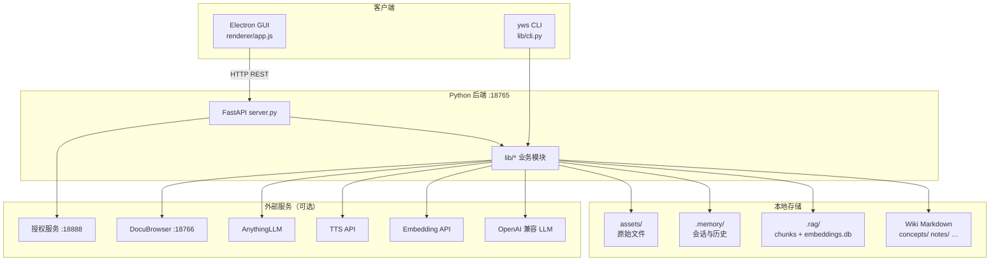
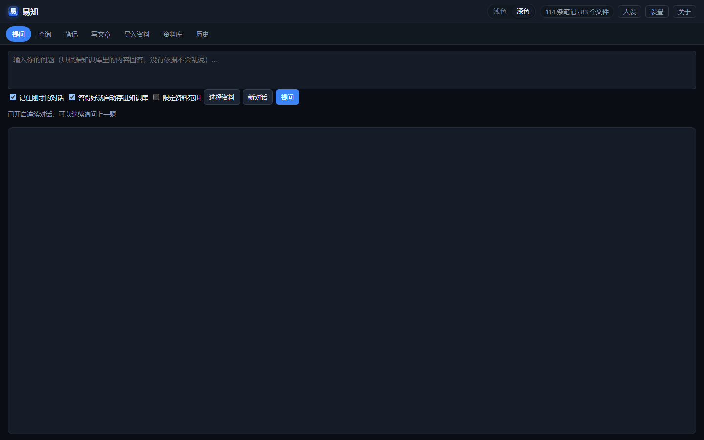
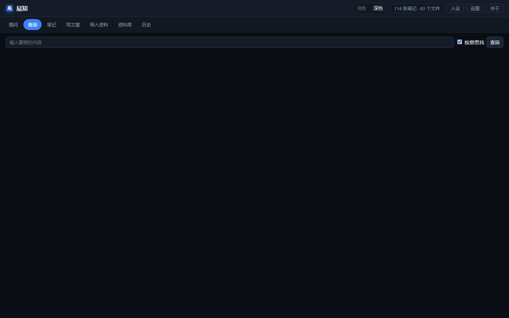
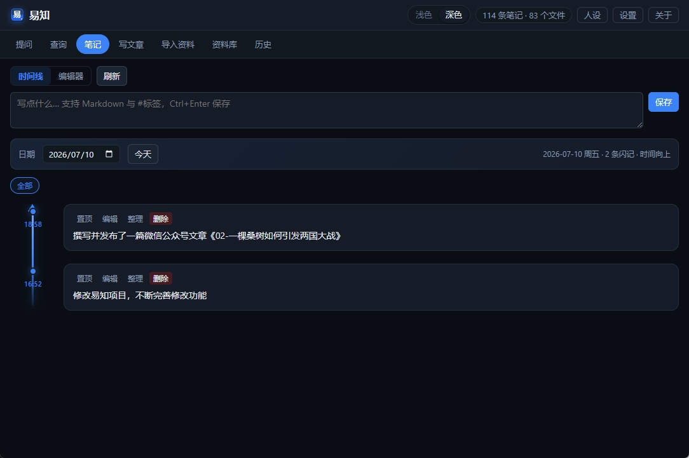

# 易知（Myknowledge）项目报告书

> **文档版本**：2026-07-11  
> **产品版本**：GUI 2.0.0 · API 2.2.0  
> **项目路径**：`e:\app\Myknowledge`  
> **作者**：易文胜 · 2026  

---

## 目录

1. [执行摘要](#1-执行摘要)
2. [项目背景与定位](#2-项目背景与定位)
3. [技术架构](#3-技术架构)
4. [目录与数据模型](#4-目录与数据模型)
5. [核心功能模块](#5-核心功能模块)
6. [图形界面（Electron GUI）](#6-图形界面electron-gui)
7. [命令行（yws CLI）使用说明](#7-命令行yws-cli使用说明)
8. [配置与环境变量](#8-配置与环境变量)
9. [后端 API 概览](#9-后端-api-概览)
10. [扩展机制](#10-扩展机制)
11. [部署、运行与运维](#11-部署运行与运维)
12. [依赖与安全](#12-依赖与安全)
13. [附录](#13-附录)

---

## 1. 执行摘要

**易知**（英文名 **Myknowledge**）是一款面向个人与小型团队的**自我进化知识库**系统。它将多格式文档导入、结构化 Wiki、混合 RAG 检索、大模型问答/写作、播客音频合成、外联目录索引、Skills 工作流与 Loop Engineering 知识进化循环整合在同一套工具链中，并提供 **Electron 图形界面**与 **`yws` 命令行**两种使用方式。

| 维度 | 说明 |
|------|------|
| **核心价值** | 资料进库 → 自动索引 → 有依据问答 → 优质内容回写库 → 越用越聪明 |
| **事实约束** | 提问/写文章默认**只许引用库内片段**，无命中时不调用 LLM 编造 |
| **默认端口** | 后端 API `18765`；DocuBrowser（可选）`18766` |
| **运行形态** | 本地优先：数据与索引均在用户机器，LLM/TTS 走可配置 OpenAI 兼容 API |
| **分发形态** | 一键 bat 启动；可选订阅授权（`license-server` 子项目） |

---

## 2. 项目背景与定位

### 2.1 要解决的问题

传统笔记工具擅长「存」，但不擅长「用」：资料散落、检索弱、问答易幻觉、产出与库脱节。易知的设计目标是：

1. **统一入口**：PDF/Office/网页/音视频等一次导入，自动提取与分块索引。
2. **可信问答**：RAG 检索失败则明确拒答，而非用大模型「补全」。
3. **连续进化**：对话记忆、优质 QA 自动归档、Loop 循环发现 inbox/草稿缺口。
4. **双模操作**：GUI 面向日常使用；CLI 面向脚本、自动化与 Cursor Agent。

### 2.2 与相关项目的关系

| 组件 | 关系 |
|------|------|
| **Loop Engineering** | 适配 [cobusgreyling/loop-engineering](https://github.com/cobusgreyling/loop-engineering)，`STATE.md` + `yws loop` |
| **DocuBrowser** | 内置 `third_party/DocuBrowser`（GPL-3.0），增强文档检索 |
| **OpenMAIC 协议** | 播客 TTS 兼容 GLM/Qwen/OpenAI 等云 TTS 接口 |
| **AnythingLLM** | 可选外联 vector-search / chat fallback |

### 2.3 知识库研究方向

根目录 `purpose.md` 约束 AI 分类与标签，避免 tag 膨胀；Loop L3 可针对其中「开放问题」尝试 produce（仅 draft）。

---

## 3. 技术架构

### 3.1 总体架构



### 3.2 技术栈

| 层级 | 技术 |
|------|------|
| **语言** | Python 3.10+、JavaScript（无前端框架） |
| **后端** | FastAPI 0.115+、Uvicorn、Pydantic |
| **桌面** | Electron 33、`@file-viewer/web-full` 文件预览 |
| **CLI** | argparse（`python -m lib.cli`） |
| **检索** | TF 词频 + SQLite 向量（hybrid）；可选 AnythingLLM |
| **文档解析** | pypdf、pdfplumber、python-docx、python-pptx、openpyxl、Pillow、mutagen 等 |
| **记忆** | SQLite + JSONL 会话；QA 历史可导出 docx |

### 3.3 进程模型

1. **`启动易知.bat` / `launch-yizhi.bat`**：检查 Python/Node 依赖 → 可选 DocuBrowser 初始化 → `yws init`（首次）→ 启动 Electron。
2. **Electron `main.js`**：spawn `python -m backend`，轮询 `/api/health` 就绪后加载 `renderer/index.html`。
3. **CLI**：直接 import `lib/*`，不经过 HTTP（与 GUI 共用同一 wiki 根目录与 `.env`）。

---

## 4. 目录与数据模型

### 4.1 项目目录树

```
Myknowledge/
├── 启动易知.bat / launch-yizhi.bat / stop-yizhi.bat
├── yws.bat / yws-gui.bat
├── README.md / CLI.md / 操作手册.md / LOOP.md
├── .env / .env.example / purpose.md / STATE.md
├── inbox/              # 待处理文件（拖入后 yws ingest）
├── assets/             # 已归档原文件（documents/images/audio/video）
├── concepts/           # 概念、方法论
├── entities/           # 人物、工具、机构
├── sources/            # 外部资料摘要
├── comparisons/        # 对比分析
├── notes/              # 笔记（含 qa/ 自动归档问答）
├── archive/            # 归档
├── output/             # produce 产出、播客音频
├── index/              # 自动生成索引（勿手改）
├── templates/          # 新建条目模板
├── prompts/            # persona.md / ask.md / produce.md
├── skills/             # 可发现 Skills
├── .rag/               # chunks.json + embeddings.db
├── .memory/            # 对话记忆数据库
├── backend/            # FastAPI
├── lib/                # 核心业务（51+ 模块）
├── electron/           # GUI
├── scripts/            # 初始化、迁移、截图脚本
├── license-server/     # 独立授权服务
├── third_party/        # DocuBrowser 等
└── docs/               # 本文档与截图
```

### 4.2 Wiki 条目模型

每条知识为带 YAML frontmatter 的 Markdown：

| 字段 | 说明 |
|------|------|
| `type` | concept / entity / source / comparison / note |
| `title` | 标题 |
| `status` | draft / refined / archived |
| `tags` | 标签列表 |
| `links` | 关联条目 |
| `body` | Markdown 正文 |

### 4.3 RAG 索引

| 文件 | 内容 |
|------|------|
| `.rag/chunks.json` | 文本分块与元数据（来源路径、页码等） |
| `.rag/embeddings.db` | 向量 embedding（hybrid/vector 模式） |

分块参数默认：`chunk_size=520`，`overlap=80`（可在设置中调整）。

---

## 5. 核心功能模块

### 5.1 `lib/` 模块职责表

| 模块 | 职责 |
|------|------|
| `cli.py` | `yws` 命令行入口 |
| `config.py` | 路径、`.env`、LLM/RAG 配置聚合 |
| `settings.py` | GUI 可视化设置分组与 `.env` 读写 |
| `wiki.py` | Wiki CRUD、frontmatter、slug |
| `rag.py` / `rag_chunk.py` / `rag_embed.py` / `rag_scope.py` | 分块、混合检索、范围限定 |
| `rag_external.py` | AnythingLLM 外联 |
| `llm.py` | ask/produce 流式、记忆注入、人设 |
| `ingest.py` / `extract.py` | inbox 批量入库、多格式提取 |
| `url_ingest.py` / `text_ingest.py` | URL/粘贴文本入库 |
| `document_analysis.py` | 入库 LLM 分析提炼 |
| `memory.py` / `memory_db.py` | 会话、历史、自动归档 |
| `memos.py` | 闪念笔记时间线 |
| `podcast.py` / `podcast_merge.py` / `tts.py` | 播客脚本、TTS、ffmpeg 合并 |
| `produce_genres.py` / `produce_export.py` | 多体例写作、docx 导出 |
| `persona_config.py` / `prompts.py` / `output_rules.py` | 人设、提示词、输出规则 |
| `writing_style.py` | 从知识库学习语气 |
| `skills.py` / `workflows.py` | Skills 与工作流 |
| `loop_engine.py` | Loop Engineering 循环 |
| `linked_dirs.py` / `watcher.py` | 外联目录与 inbox 监视 |
| `docubrowser_bridge.py` | DocuBrowser 启停与 rescan |
| `license_*.py` | 订阅授权客户端 |
| `library.py` / `assets.py` / `upload_jobs.py` | 资料库与异步上传 |

### 5.2 RAG 检索模式

| 模式 | 说明 |
|------|------|
| `keyword` | 仅 TF 词频 |
| `vector` | 仅 embedding 相似度 |
| `hybrid` | 词频 + 向量加权（**默认**） |
| `external` | 仅 AnythingLLM |

提问默认 Top 6 片段，写文章 Top 8；标题命中约 1.35× 加权。

### 5.3 提问（Ask）流水线

1. 可选：按 GUI/CLI 限定资料范围（scoped 预过滤 + 关键词检索）。
2. 混合 RAG 检索 → 注入 system（含客观分析规则、人设、风格）。
3. 注入最近 N 轮对话 + 相关历史 QA。
4. 流式输出 HTML；前端渲染脚注与「打开原文」链接。
5. 有依据且用户开启时：自动归档至 `notes/qa/`。

### 5.4 写文章（Produce）与播客

- **体例**：综述、教程、对比、播客稿等（`produce_genres.py`）。
- **流式**：`/api/produce/stream` 降低首字延迟。
- **播客**：解析 `## 对话脚本` 内主持人/嘉宾行 → 双音色 TTS → 合并 `full.mp3`/`full.wav`。
- **待确认**：产出中 `[待人工确认]` 块可在 GUI 勾选确认后再合成。

---

## 6. 图形界面（Electron GUI）

### 6.1 启动方式

```powershell
# 推荐：双击
e:\app\Myknowledge\启动易知.bat

# 或命令行
e:\app\Myknowledge\launch-yizhi.bat
yws gui
```

首次启动自动：`pip install -r requirements.txt`、`npm install`（electron 目录）、`yws init`、复制 `.env.example`。

### 6.2 主界面总览


顶栏：**人设** · **设置** · **关于** · 浅/深色主题 · 笔记/文件统计。

### 6.3 七大 Tab 功能

| Tab | 截图 | 功能摘要 |
|-----|------|----------|
| **提问** |  | 流式 RAG 问答；连续对话；限定资料；输出规则纠错 |
| **查询** |  | 关键词 / 语义检索，分页结果 |
| **笔记** |  | 闪念时间线 + Wiki 条目编辑 |
| **写文章** |  | 多体例产出、保存入库、Word 导出、播客 TTS |
| **导入资料** |  | 文件/URL/文本、外联目录、工作流快捷入口 |
| **资料库** |  | 原文件与 RAG 片段；File-Viewer 预览 |
| **历史** |  | 问答历史、会话、继续对话、导出 docx |

### 6.4 设置与人设

| 模态 | 截图 | 说明 |
|------|------|------|
| **设置** |  | 可视化编辑 `.env`：LLM、RAG、TTS、导入、授权等；保存即热加载 |
| **人设** |  | 预设模板、语气/偏好多选、预览生成的人设 prompt |

设置弹窗宽度为父窗口 **80%**，表单项 **标签与控件同行**、分组内 **两列** 排列；TTS 音色为下拉 + **试听**。

### 6.5 文件预览

Electron 通过 `/viewer` 打开 `@file-viewer/web-full`，支持 PDF（含页码跳转）、Office、图片等；依据脚注可跳到 PDF 指定页。

### 6.6 重新生成界面截图

需先启动后端：

```powershell
cd e:\app\Myknowledge
python -m backend
# 新终端
pip install playwright
python -m playwright install chromium
python scripts/capture_report_screenshots.py
```

输出目录：`docs/report-screenshots/`。

---

## 7. 命令行（yws CLI）使用说明

### 7.1 入口与环境

| 方式 | 命令 |
|------|------|
| 项目目录 | `.\yws.bat <子命令>` |
| PATH 加入 `Myknowledge` | 任意目录 `yws list` |
| PATH 加入 `e:\app` | 使用根目录转发 `yws.bat` |
| Python 模块 | `python -m lib.cli <子命令>` |

**前置**：Python 3.10+、`pip install -r requirements.txt`、配置 `.env`（LLM Key 用于 ask/produce/TTS）。

**永久加入 PATH（推荐，PowerShell）**：

```powershell
$dir = "e:\app\Myknowledge"
$userPath = [Environment]::GetEnvironmentVariable("PATH", "User")
if ($userPath -notlike "*$dir*") {
  [Environment]::SetEnvironmentVariable("PATH", "$userPath;$dir", "User")
}
```

改 PATH 后须**重新打开终端**。勿用 `setx PATH ...`（易截断超长 PATH）。

### 7.2 命令总览

| 命令 | 作用 |
|------|------|
| `yws init` | 初始化目录树、模板、索引 |
| `yws ask "问题"` | RAG + LLM 流式回答 |
| `yws query 关键词` | Wiki 条目关键词搜索 |
| `yws query 关键词 --rag` | RAG 语义片段检索 |
| `yws produce "主题"` | 基于库内资料产出 Markdown |
| `yws produce "主题" --wiki` | 产出并写入 wiki（draft） |
| `yws list` | 列出知识条目 |
| `yws add --title "..."` | 新增条目 |
| `yws delete <相对路径.md>` | 删除条目 |
| `yws url "https://..."` | 网页抓取入库 |
| `yws ingest` | 整理 `inbox/` 全部待处理文件 |
| `yws index` | 重建 wiki 索引 + RAG |
| `yws rag status` | RAG/向量/外联状态 |
| `yws rag rebuild` | 仅重建 `.rag/` |
| `yws watch` | 监视 inbox/资产自动 ingest |
| `yws gui` | 打开 Electron |
| `yws skill list\|show\|match\|run` | Skills |
| `yws loop run\|status\|watch` | Loop Engineering |

完整参数见 [`CLI.md`](../CLI.md)。

### 7.3 初始化

```powershell
cd e:\app\Myknowledge
pip install -r requirements.txt
copy .env.example .env
notepad .env
yws init
```

### 7.4 导入资料

**支持格式**：pdf · ppt/pptx · xls/xlsx · doc/docx · txt · md · png · jpg · mp3 · mp4 · **URL**

```powershell
# 方式 A：拖文件到 inbox 后
yws ingest

# 方式 B：URL
yws url "https://example.com/article"
yws url "https://example.com/article" --force

# 方式 C：后台监视
yws watch
```

### 7.5 提问（ask）

```powershell
yws ask "易知支持哪些文件格式"
yws ask "展开刚才第二点"              # 默认记住 CLI 会话
yws ask "问题" --new-session         # 新会话
yws ask "问题" --no-remember         # 不带上下文
yws ask "问题" --top 8               # 更多 RAG 片段
yws ask "问题" --json --no-stream    # JSON 输出
```

**无库内命中时**固定返回：*知识库中暂无足够信息，无法基于库内事实回答该问题。*

| 参数 | 说明 |
|------|------|
| `--top N` | RAG 片段数（默认 5） |
| `--session ID` | 指定会话 |
| `--new-session` | 新会话 |
| `--no-remember` | 单次提问 |
| `--no-archive` | 不归档 QA |
| `--json` | JSON（需 `--no-stream`） |
| `--no-stream` | 非流式 |

### 7.6 查询（query / list）

```powershell
yws query 四闭环
yws query RAG --rag --top 5
yws query 炼钢 --rag --json
yws list --type source
yws list --no-inbox --json
```

### 7.7 产出（produce）

```powershell
yws produce "自我进化知识库的使用方法"
yws produce "知识进化四闭环" --wiki
yws produce "测试" --out D:\temp\test.md --top 8
```

默认输出：`output/主题-日期.md`。

### 7.8 条目管理

```powershell
yws add --type note --title "会议记录" --body "# 要点\n\n..."
yws add --type concept --title "示例" --file D:\note.md --tag 知识管理
yws delete notes/会议记录.md
```

手改 Markdown 后执行 `yws index` 刷新 RAG。

### 7.9 RAG 维护

```powershell
yws rag status
yws rag rebuild
yws index          # 含 index/*.md 页面生成
yws ingest && yws ask "刚导入的文档讲了什么"
```

### 7.10 Skills

```powershell
yws skill list
yws skill show my-skill
yws skill match "关键词"
yws skill run my-skill --arg value
```

Skills 目录默认：`skills/`、可选 `~/.cursor/skills`（由 `.env` 控制）。

### 7.11 Loop Engineering

```powershell
yws loop status
yws loop run --level 1    # 仅 triage + 写 STATE.md
yws loop run --level 2    # + 自动 ingest/index
yws loop run --level 3    # + 对开放问题 produce（draft）
yws loop run --dry-run
yws loop watch --interval 3600
```

硬约束：L3 仅 draft、不删 wiki、不 force URL；`MYKNOWLEDGE_LOOP_WEEK_ONE=1` 时强制 L1。

### 7.12 典型工作流

```powershell
copy D:\资料\*.pdf e:\app\Myknowledge\inbox\
yws ingest
yws ask "这份 PDF 的核心结论是什么"
yws produce "总结：XX 主题" --wiki
yws list --type source
yws rag status
```

### 7.13 常见问题（CLI）

| 现象 | 处理 |
|------|------|
| `yws` 找不到 | 检查 PATH；或 `e:\app\Myknowledge\yws.bat` |
| ask 无内容 | 先 `ingest`/`index`；或 `--top` 加大 |
| LLM 报错 | 检查 `.env` 中 BASE/KEY/MODEL |
| 端口占用 | `.env` 改 `MYKNOWLEDGE_PORT`，重启 |

---

## 8. 配置与环境变量

配置源：复制 `.env.example` → `.env`；GUI **设置** 保存后热加载（改端口需重启）。

### 8.1 大模型

```env
MYKNOWLEDGE_LLM_API_BASE=https://api.example.com/v1
MYKNOWLEDGE_LLM_API_KEY=sk-...
MYKNOWLEDGE_LLM_MODEL=qwen3.6
MYKNOWLEDGE_LLM_TEMPERATURE_ASK=0.15
MYKNOWLEDGE_LLM_TEMPERATURE_PRODUCE=0.35
MYKNOWLEDGE_LLM_MAX_TOKENS_PRODUCE=8192
```

### 8.2 对话与记忆

```env
MYKNOWLEDGE_ASK_REMEMBER=1
MYKNOWLEDGE_AUTO_ARCHIVE_QA=1
MYKNOWLEDGE_MEMORY_TURNS=6
MYKNOWLEDGE_MEMORY_QA=3
```

### 8.3 RAG

```env
MYKNOWLEDGE_RAG_MODE=hybrid
MYKNOWLEDGE_RAG_TOP_ASK=6
MYKNOWLEDGE_RAG_TOP_PRODUCE=8
MYKNOWLEDGE_RAG_HYBRID_KEYWORD=0.35
MYKNOWLEDGE_RAG_HYBRID_VECTOR=0.65
MYKNOWLEDGE_RAG_CHUNK_SIZE=520
MYKNOWLEDGE_RAG_CHUNK_OVERLAP=80
MYKNOWLEDGE_EMBEDDING_MODEL=text-embedding-3-small
```

### 8.4 播客 TTS

```env
MYKNOWLEDGE_TTS_PROVIDER=        # 空=自动跟随 LLM 端点
MYKNOWLEDGE_TTS_API_KEY=         # 空=复用 LLM Key
MYKNOWLEDGE_TTS_VOICE_HOST=tongtong
MYKNOWLEDGE_TTS_VOICE_GUEST=xiaochen
MYKNOWLEDGE_TTS_SPEED=1.0
```

### 8.5 外联与 DocuBrowser

```env
MYKNOWLEDGE_EXTRA_DIRS=D:\Docs\参考
MYKNOWLEDGE_LINKED_DIRS_AUTO_INDEX=1
MYKNOWLEDGE_DOCUBROWSER_ENABLED=1
MYKNOWLEDGE_DOCUBROWSER_PORT=18766
```

### 8.6 授权（分发用户）

```env
MYKNOWLEDGE_LICENSE_REQUIRED=1
MYKNOWLEDGE_LICENSE_SERVER=https://license.example.com
MYKNOWLEDGE_LICENSE_JWT_SECRET=...
```

开发自用可设 `MYKNOWLEDGE_LICENSE_REQUIRED=0`。

---

## 9. 后端 API 概览

**基址**：`http://127.0.0.1:18765`  
**健康检查**：`GET /api/health`

| 分组 | 代表路由 |
|------|----------|
| 问答 | `POST /api/ask`、`POST /api/ask/stream` |
| 产出 | `POST /api/produce`、`POST /api/produce/stream`、`GET /api/produce/genres` |
| 播客 | `POST /api/produce/podcast-audio`、`GET /api/podcast/audio` |
| TTS | `GET /api/tts/voices`、`POST /api/tts/preview` |
| Wiki | `GET/POST/PUT/DELETE /api/pages` |
| 资料 | `POST /api/upload`、`POST /api/ingest`、`GET /api/library/*` |
| 记忆 | `GET /api/memory/sessions`、`GET /api/memory/history` |
| 设置 | `GET/PUT /api/settings`、`GET/PUT /api/persona` |
| 授权 | `GET /api/license/status`、`POST /api/license/activate` |
| Loop/Skills | `GET /api/loop/status`、`POST /api/skills/run` |

未授权时多数 `/api/*` 返回 **402**（健康检查、设置、人设等部分豁免）。

---

## 10. 扩展机制

### 10.1 Skills

- 在 `skills/<name>/SKILL.md` 定义工作流。
- GUI「导入资料」可挂载快捷方式；CLI `yws skill run`。

### 10.2 工作流（Workflows）

用户可在 GUI 保存多步自动化（导入 → ingest → 等），持久化于 wiki 配置。

### 10.3 Loop Engineering

- 审计：`STATE.md` 记录 triage 与待办。
- 与 Cursor Automation 配合：定时 `yws loop run`。

### 10.4 Obsidian 协同

Wiki 根目录即 Obsidian vault；外部编辑后 `yws index` 同步 RAG。

---

## 11. 部署、运行与运维

### 11.1 开发模式

```powershell
# 终端 1：仅 API
cd e:\app\Myknowledge
python -m backend

# 终端 2：Electron
cd e:\app\Myknowledge\electron
npm start
```

### 11.2 停止服务

```powershell
e:\app\Myknowledge\stop-yizhi.bat
```

### 11.3 授权服务（运维）

```powershell
e:\app\Myknowledge\scripts\run-license-server.bat
# 默认 http://127.0.0.1:18888
```

详见 [`docs/易知授权运营.md`](易知授权运营.md)。

### 11.4 维护脚本

| 脚本 | 用途 |
|------|------|
| `scripts/init_wiki.py` | 初始化 wiki 结构 |
| `scripts/update_index.py` | 重建 index/*.md |
| `scripts/setup_docubrowser.py` | DocuBrowser 安装 |
| `scripts/migrate_memory_db.py` | 记忆库迁移 |
| `scripts/capture_report_screenshots.py` | 报告截图 |

---

## 12. 依赖与安全

### 12.1 Python 依赖（节选）

`fastapi`、`uvicorn`、`pypdf`、`python-docx`、`openpyxl`、`Pillow`、`mutagen` 等（见 `requirements.txt`）。

### 12.2 系统可选组件

| 组件 | 用途 |
|------|------|
| **Tesseract** | 图片 OCR |
| **ffmpeg** | 播客 MP3 合并 |
| **Node.js** | Electron 与 npm |
| **bun** | URL 抓取（baoyu-url-to-markdown 路径） |

### 12.3 安全说明

- API 默认绑定 `127.0.0.1`，不对外暴露。
- 密钥存于本地 `.env`，GUI 密码项保存时掩码显示。
- 外联目录**只读**索引，不修改源文件。
- 提问/产出提示词含「禁止编造」硬性约束；人设可关但 grounded 规则建议保留。

---

## 13. 附录

### 13.1 相关文档索引

| 文档 | 路径 |
|------|------|
| 项目 README | [`README.md`](../README.md) |
| CLI 完整手册 | [`CLI.md`](../CLI.md) |
| 操作手册 | [`操作手册.md`](../操作手册.md) |
| Loop 说明 | [`LOOP.md`](../LOOP.md) |
| 授权运营 | [`易知授权运营.md`](易知授权运营.md) |
| 本报告 | [`易知项目报告书.md`](易知项目报告书.md) |

### 13.2 版本与能力标记

`/api/health` 返回 `capabilities` 示例：

`ask_stream`, `memory`, `skills`, `loop`, `url`, `rag_hybrid`, `rag_external`, `docubrowser`, `license`, `file_viewer_local`

### 13.3 报告截图清单

| 文件 | 说明 |
|------|------|
| `report-screenshots/00-main-ask.png` | 主界面 · 提问 |
| `report-screenshots/01-tab-ask.png` | 提问 Tab |
| `report-screenshots/02-tab-query.png` | 查询 Tab |
| `report-screenshots/03-tab-notes.png` | 笔记 Tab |
| `report-screenshots/04-tab-produce.png` | 写文章 Tab |
| `report-screenshots/05-tab-import.png` | 导入资料 Tab |
| `report-screenshots/06-tab-library.png` | 资料库 Tab |
| `report-screenshots/07-tab-history.png` | 历史 Tab |
| `report-screenshots/08-modal-settings.png` | 设置弹窗 |
| `report-screenshots/09-modal-persona.png` | 人设弹窗 |

---

*本报告基于 `e:\app\Myknowledge` 代码库与 2026-07-11 运行截图整理。功能迭代以仓库内 README、CLI.md 为准。*
