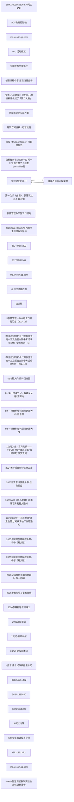

# 知识关联图

> 展示前 50 个节点（上限 50）

```mermaid
flowchart LR
  5c0f73009059e36e_AI死亡之轮["5c0f73009059e36e-AI死亡之轮"]
  AI对教育的影响["AI对教育的影响"]
  mp_weixin_qq_com["mp.weixin.qq.com"]
  一_活动概览["一、活动概览"]
  全国大赛全景描述["全国大赛全景描述"]
  创意编程小学组_现场任务书["创意编程小学组 现场任务书"]
  受够了_AI_瞎编_我把自己的资料库做成了_第二大脑_["受够了 AI 瞎编？我把自己的资料库做成了「第二大脑」"]
  易知商业化实现方案["易知商业化实现方案"]
  易知订阅授权___运营说明["易知订阅授权 · 运营说明"]
  易知_Myknowledge_项目报告书["易知（Myknowledge）项目报告书"]
  目标任务书_20260730_写一份冒烟任务书_检查ywsskilllist能["目标任务书-20260730-写一份冒烟任务书：检查ywsskilllist能"]
  知识进化四闭环["知识进化四闭环"]
  第一次读_史记__我建议从这_5_篇开始["第一次读《史记》，我建议从这 5 篇开始"]
  自我进化知识库架构["自我进化知识库架构"]
  质量管理办公室工作规划["质量管理办公室工作规划"]
  2b06299d40a7d67b_AI给学生的课程当导师["2b06299d40a7d67b-AI给学生的课程当导师"]
  2b2487d8a892["2b2487d8a892"]
  93772f177501["93772f177501"]
  mp_weixin_qq_com_1["mp.weixin.qq.com"]
  易知改进路线图["易知改进路线图"]
  演讲稿["演讲稿"]
  ___质量管理一办六组工作规划汇总_202412_["!!!质量管理一办六组工作规划汇总（202412）"]
  _学部成绩分析会代表发言普高一三及质管办期中考试成绩分析_202412__1_["!学部成绩分析会代表发言普高一三及质管办期中考试成绩分析（202412）(1)"]
  _学部成绩分析会代表发言普高一三及质管办期中考试成绩分析_202412_["!学部成绩分析会代表发言普高一三及质管办期中考试成绩分析（202412）"]
  01_5篇入门顺序_信息图["01-5篇入门顺序-信息图"]
  01_第一次读史记_我建议从这5篇开始["01-第一次读史记，我建议从这5篇开始"]
  02_一棵桑树如何引发两国大战_信息图["02-一棵桑树如何引发两国大战-信息图"]
  02_一棵桑树如何引发两国大战["02-一棵桑树如何引发两国大战"]
  1山河入史___岁月共读___史记_里的_微末小事_如何掀起_惊天波澜_["1山河入史 · 岁月共读——《史记》里的“微末小事”如何掀起“惊天波澜”"]
  2024教学质量评价实施方案["2024教学质量评价实施方案"]
  2025计算思维类任务书_任务题目["2025计算思维类任务书-任务题目"]
  20260602_扬外教育_校本课程专刊征文通知["20260602《扬外教育》校本课程专刊征文通知"]
  20260602关于开展教师_课堂胜任力_考核评估工作的通知["20260602关于开展教师“课堂胜任力”考核评估工作的通知"]
  2026全国赛创意编程命题_初中_易文胜_["2026全国赛创意编程命题-初中（易文胜）"]
  2026全国赛创意编程命题_小学_易文胜_["2026全国赛创意编程命题-小学（易文胜）"]
  2026全国赛创意编程命题_小学_初中_["2026全国赛创意编程命题（小学+初中）"]
  2026参赛指导与备赛策略["2026参赛指导与备赛策略"]
  2026参赛指导培训讲义["2026参赛指导培训讲义"]
  2026答辩培训["2026答辩培训"]
  2史记_五帝本纪["2史记·五帝本纪"]
  3史记_夏殷周本纪["3史记·夏殷周本纪"]
  4史记_秦本纪与秦始皇本纪["4史记·秦本纪与秦始皇本纪"]
  868d509614e2["868d509614e2"]
  94f601385830["94f601385830"]
  ad23fc87bc83["ad23fc87bc83"]
  AI死亡之轮["AI死亡之轮"]
  AI给学生的课程当导师["AI给学生的课程当导师"]
  e25318313dd1["e25318313dd1"]
  mp_weixin_qq_com_2["mp.weixin.qq.com"]
  OKAY智慧课堂教学实践阶段性总结报告["OKAY智慧课堂教学实践阶段性总结报告"]
  知识进化四闭环 --> 自我进化知识库架构
  自我进化知识库架构 --> 知识进化四闭环
```
