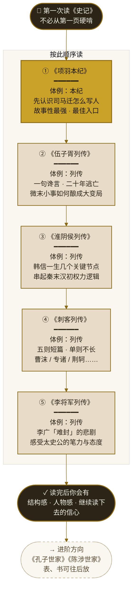
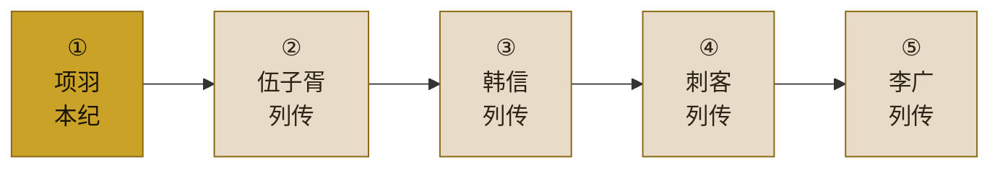
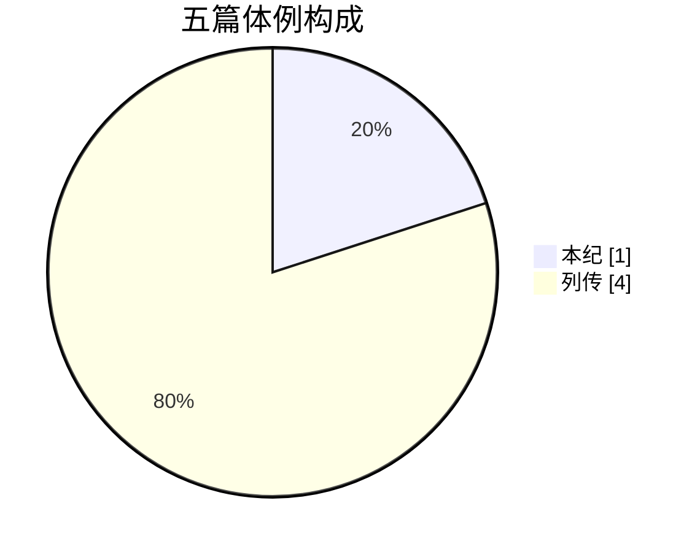

# 《史记》入门 · 5 篇阅读路径

> 老易推荐 · 我读史记 · 入门系列 01  
> 1 本纪 + 4 列传 · 约 3–4 周读完

## 横版简图（适合公众号头图裁切）

## 体例分布

---

**导出建议**

- 在 [Mermaid Live Editor](https://mermaid.live) 粘贴上方代码，导出 PNG/SVG 作公众号配图
- 竖版主图适合文章内嵌；横版简图适合封面或朋友圈九宫格
- 配色参考古籍纸色 + 赭黄，可与手抄本照片风格统一
